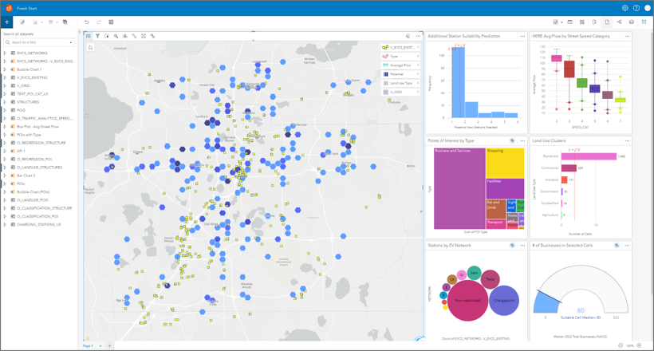
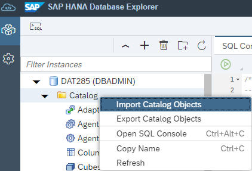

# Getting Started

This section should give you an understanding of the base scenario and data. Additionally, we will describe the SAP HANA Cloud free tier or trial setup in case you want to run the exercises yourself. As we will process the data mainly using SQL, the SQL editor of SAP HANA Database Explorer (DBX) is sufficient from a tooling perspective. However, for the "full experience" we recommend DBeaver, QGIS (or Esri ArcGIS Pro) for spatial data, and Python/Jupyter Notebooks to work with the SAP HANA client API for machine learning (hana-ml). At the end of this section, you will find links to additional information on SAP HANA Cloud Multi-Model.

## Base Data & Demo Scenario

During the exercises, we will work with data describing building structures, electric vehicle charging stations, and the road network in the Orlando, Florida area. We will walk through some building blocks that make up the "EV Charging Stations site Selection" demo.
For a detailed description and videos of the demo scenario, please see the blog post [Optimal Electric Vehicle Charging Station Placement – An Intelligent Data Application Demo](https://blogs.sap.com/2023/05/15/optimal-electronic-vehicle-charging-station-placement-an-intelligent-data-application-demo/).

## Working with the Exercise Scripts

For each exercise, there is a detailed description of the SQL commands and processing steps. A condensed version, i.e. the code only, can also be found in each of the exercises' folder. You can simply copy or open the code into a SQL editor (SAP HANA Cloud Database Explorer or DBeaver) and execute. The required data in form of SAP HANA database table export is located in the [data folder](../../data/) of this repository. Data import can be handle via the Database Explorer.

For more details see [Import Data into SAP HANA Cloud, SAP HANA Database](https://developers.sap.com/tutorials/hana-cloud-mission-trial-5.html).

Exercise 1 (and 4) cannot be successfully completed on the SAP HANA Cloud free tier or trial version (refer to next section for more details). In this case you'll need to run an extra data import at the beginning of exercise 3 (importing results of exercise 1).

## SAP HANA Cloud Free Tier or Trial setup

Exercises 2 and 3 can be run on a SAP HANA Cloud free tier or trial system. For instructions how to set up, I recommend the tutorial [Jump Start Your SAP HANA Cloud, SAP HANA Database (free tier or trial)](https://developers.sap.com/mission.hana-cloud-database-get-started.html). 
To run the optional exercises 1 (Manage JSON data using the Document Store) and 4 (Utilizing machine learning), you will need a SAP HANA Cloud with more memory/vCPU assigned. Make sure to enable the **Script Server** and **Document Store**. See
* [SAP HANA Database Additional Features](https://help.sap.com/docs/hana-cloud/sap-hana-cloud-administration-guide/sap-hana-database-additional-features) and
* [SAP HANA Cloud Document Store – Enabling JSON Document Store](https://blogs.sap.com/2022/12/09/sap-hana-cloud-document-store-enabling-json-document-store/)

The HANA database user for exercise 4 (Utilize machine learning) requires additional privileges
* role `AFL__SYS_AFL_AFLPAL_EXECUTE` and 
* role `AFL__SYS_AFL_AFLPAL_EXECUTE_WITH_GRANT_OPTION` to execute PAL algorithms

## DBeaver, QGIS, GDAL, hana-ml, Cytoscape

The **SAP HANA Database Explorer** provides a SQL editor, table viewer, and data analysis tools. See [Tools to Manage and Access the SAP HANA Cloud, SAP HANA Database](https://developers.sap.com/tutorials/hana-cloud-mission-trial-4.html) to learn how to access SAP HANA Cloud Database Explorer. For a "full experience" we recommend the following tools in addition.

**DBeaver** an open source database administration and development tool. You can run the exercise scripts in DBeaver and get simple spatial visualizations. See Mathias Kemeter's blog for [installation instructions](https://blogs.sap.com/2020/01/08/good-things-come-together-dbeaver-sap-hana-spatial-beer/).

**QGIS**<a name="qgis"> an open source Geographical Information System (GIS). QGIS can connect to SAP HANA and provides great tools for advanced maps. Again, read Mathias' blog to [get it up and running](https://blogs.sap.com/2021/03/01/creating-a-playground-for-spatial-analytics/).

**hana-ml** the Jupyter Notebook to load JSON data into the document store (exercise 1) uses the python machine learning client for SAP HANA (hana-ml). There is a lot more in the hana-ml package for the data scientist - see [pypi.org](https://pypi.org/project/hana-ml/) and [hana-ml reference](https://help.sap.com/doc/1d0ebfe5e8dd44d09606814d83308d4b/latest/en-US/index.html).

##  Background Material

[SAP HANA Spatial Resources](https://blogs.sap.com/2020/11/02/sap-hana-spatial-resources-reloaded/) 
[SAP HANA Graph Resources](https://blogs.sap.com/2021/07/21/sap-hana-graph-resources/) 
[SAP HANA Machine Learning Resources](https://blogs.sap.com/2021/05/27/sap-hana-machine-learning-resources/)

## Summary

You are all set.

Continue to - [Exercise 1 - Manage JSON Data](../ex1/README.md)
