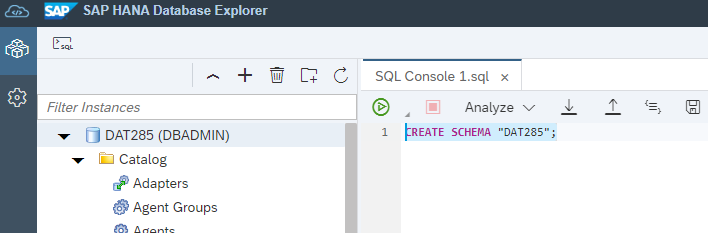
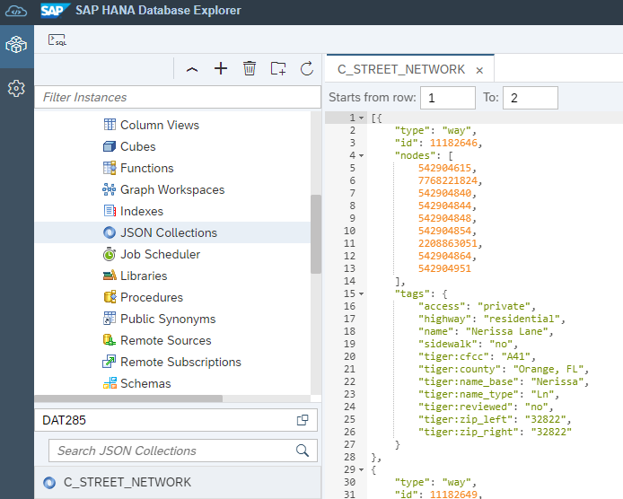
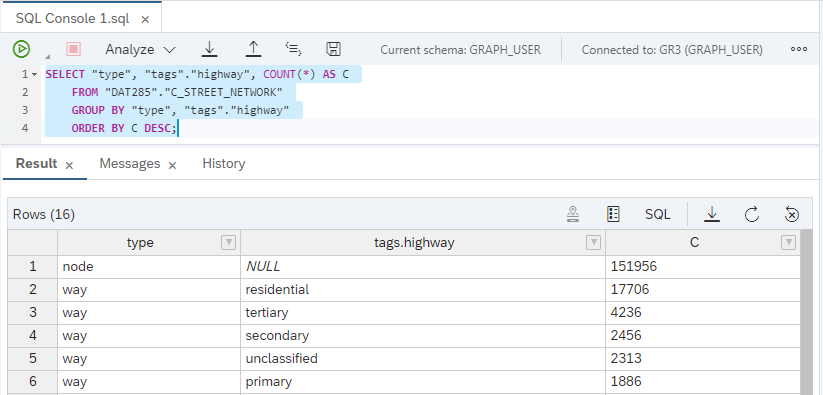
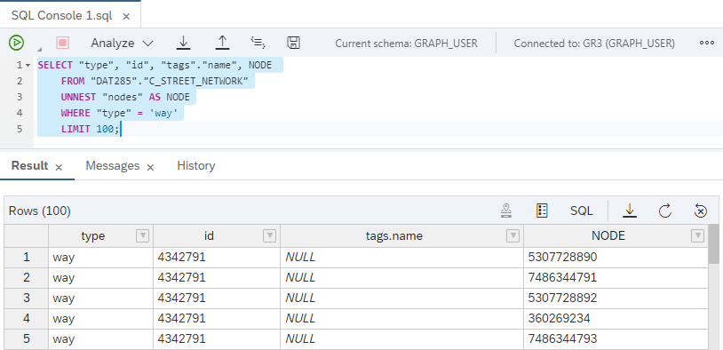
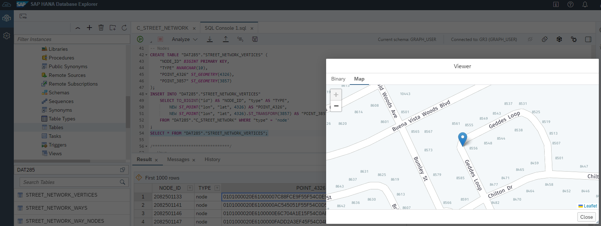
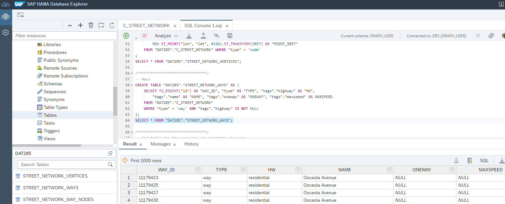
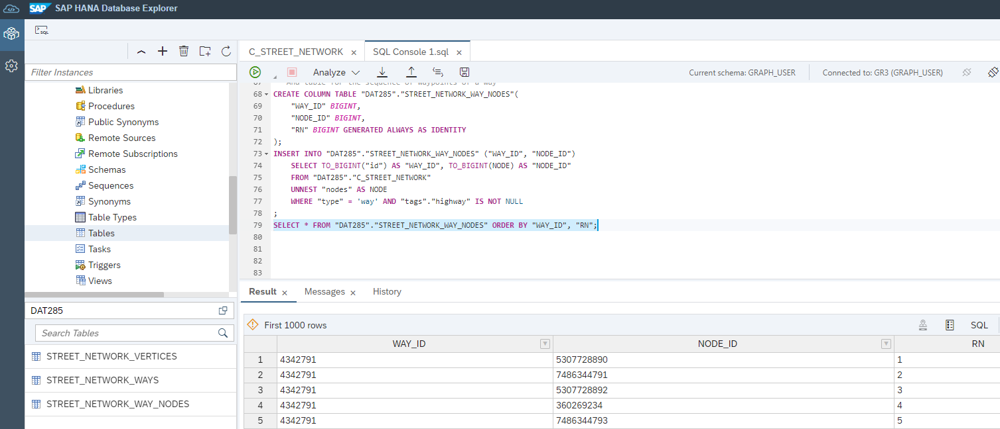

# Exercise 1 - Manage JSON Data

This exercise is optional. It requires a Python environment and SAP HANA Cloud system with the **JSON Document Store** enabled. See [SAP HANA Cloud Free Tier or Trial setup](../ex0/README.md#sap-hana-cloud-free-tier-or-trial-setup).

If you have a SAP HANA Cloud trial or free tier, skip this exercise.

In this exercise, we will use the SAP HANA Cloud JSON Document Store and the [Python machine learning client for SAP HANA](https://pypi.org/project/hana-ml/) (hana-ml) to retrieve street network data from [OpenStreetMap](https://www.openstreetmap.org) and store JSON data in the database.


## Exercise 1.1 Importing OpenStreetMap Street Network Data<a name="11"></a>

First of all, create a new schema "DAT285" in your database, e.g. using the SAP HANA Database Explorer.
```SQL
CREATE SCHEMA "DAT285";
```


Now open the Jupyter Notebook [2023 Q3 TechEd DAT285 OSM load.ipynb](2023%20Q3%20TechEd%20DAT285%20OSM%20load.ipynb) and make sure you have `pandas`, `hana-ml`, and `requests` installed.

```python
# Import required libraries
import hana_ml
import pandas as pd
import requests
from hana_ml.dataframe import ConnectionContext
```
Next, connect to you SAP HANA Cloud database.
```python
# Connect to SAP HANA Cloud
# The JSON Document Store has to be enabled.
# This does NOT work with SAP HANA Cloud free tier or trial!

# Connect using secure store
# cc = ConnectionContext(userkey='[userkey]', encrypt=True)

host = '[YourHostName]' # e.g. somecharacters.hanacloud.ondemand.com
port = 443
user = '[YourUser]' # e.g. DBADMIN
password = '[YourUserPassword]'
cc= ConnectionContext(
    address=host, 
    port=port, 
    user=user, 
    password=password, 
    encrypt='true'
    )
schema="DAT285"
print('HANA version:', cc.hana_version())
print('hana-ml version:', hana_ml.__version__)
print('pandas version:', pd.__version__)
```
We'll use the [overpass turbo API](https://overpass-turbo.eu/) to retrieve data from OSM.
```python
# All car ways
# way["highway"]["area"!~"yes"]["highway"!~"abandoned|bridleway|bus_guideway|construction|corridor|cycleway|elevator|escalator|footway|path|pedestrian|planned|platform|proposed|raceway|service|steps|track"]["motor_vehicle"!~"no"]["motorcar"!~"no"]["service"!~"alley|driveway|emergency_access|parking|parking_aisle|private"]

# Orlando area (28.365266048079008,-81.54412854399905, 28.62735114041908, -81.25956141698434)
overpass_query = """
    [out:json];
    (
    way(28.365266048079008,-81.54412854399905, 28.62735114041908, -81.25956141698434)["highway"]["area"!~"yes"]["highway"!~"abandoned|bridleway|bus_guideway|construction|corridor|cycleway|elevator|escalator|footway|path|pedestrian|planned|platform|proposed|raceway|service|steps|track"]["motor_vehicle"!~"no"]["motorcar"!~"no"]["service"!~"alley|driveway|emergency_access|parking|parking_aisle|private"];
    );
    out body;
    >;
    out skel qt;
"""
overpass_url = "http://overpass-api.de/api/interpreter"
response = requests.get(overpass_url, params={'data': overpass_query})
data = response.json()
```
We use hte function `create_collection_from_elemets` to store the data in SAP HANA Cloud JSON Document Store.
```python
# The overpass API resturns JSON which we can store in the SAP HANA Document Store.
from hana_ml.docstore import create_collection_from_elements
coll = create_collection_from_elements(
    connection_context = cc,
    schema = schema,
    collection_name = 'C_STREET_NETWORK',
    elements = data["elements"], 
    drop_exist_coll = True
    )
```

## Exercise 1.2 Inspect, Query, and Transform JSON Data<a name="12"></a>

Let's switch back to the Database Explorer and inspect the street network collection: right-click the `C_STREET_NETWORK` collection and select view "view JSON".



We can use SQL to query the collection.

```SQL
-- Inspect the collection
SELECT * FROM "DAT285"."C_STREET_NETWORK";

SELECT "type", COUNT(*) AS C 
	FROM "DAT285"."C_STREET_NETWORK" 
	GROUP BY "type";

-- There are "way"s and "node"s in the data: street segments and street junctions
SELECT * FROM "DAT285"."C_STREET_NETWORK" WHERE "type" = 'node' LIMIT 10;
SELECT * FROM "DAT285"."C_STREET_NETWORK" WHERE "type" = 'way' LIMIT 10;

-- Use the object style/dot notation to query
SELECT "type", "tags"."highway", COUNT(*) AS C 
	FROM "DAT285"."C_STREET_NETWORK" 
	GROUP BY "type", "tags"."highway" 
	ORDER BY C DESC;
```

There are `nodes` and `ways` in the data. The `ways` are street segments and the `nodes` are junctions.



```SQL
-- The "ways" contain an array of "nodes", e.g. "nodes": [99549558,1029814722,8502705960,1700923338]
-- We can unnest this array.
SELECT "type", "id", "tags"."name", NODE 
	FROM "DAT285"."C_STREET_NETWORK"
	UNNEST "nodes" AS NODE
	WHERE "type" = 'way'
	LIMIT 100;
```

The `ways` contain an array of `nodes` which we can unnest with the following query.



Next, we will extract the nodes and ways from the JSON collection and populate three tables: `STREET_NETWORK_VERTICES`, `STREET_NETWORK_WAYS`, and `STREET_NETWORK_WAY_NODES`. These tables will be used in exercise 3 to run network analysis using the SAP HANA Cloud Graph engine.

```SQL
/********************************/
-- Let's copy the nodes and the ways documents into tables and create point geometries from lon/lat values.
/********************************/
-- Nodes
CREATE TABLE "DAT285"."STREET_NETWORK_VERTICES" (
	"NODE_ID" BIGINT PRIMARY KEY,
	"TYPE" NVARCHAR(10),
	"POINT_4326" ST_GEOMETRY(4326),
	"POINT_3857" ST_GEOMETRY(3857)
);
INSERT INTO "DAT285"."STREET_NETWORK_VERTICES"
	SELECT TO_BIGINT("id") AS "NODE_ID", "type" AS "TYPE", 
		NEW ST_POINT("lon", "lat", 4326) AS "POINT_4326",
		NEW ST_POINT("lon", "lat", 4326).ST_TRANSFORM(3857) AS "POINT_3857"
	FROM "DAT285"."C_STREET_NETWORK" WHERE "type" = 'node'
;
SELECT * FROM "DAT285"."STREET_NETWORK_VERTICES";
```
You can double-click on a value in the spatial columns to bring up a map.



We'll flatten some values of the "tags" structure into the `STREET_NETWORK_WAYS` table.
```SQL
/********************************/
-- Ways
CREATE TABLE "DAT285"."STREET_NETWORK_WAYS" AS (	
	SELECT TO_BIGINT("id") AS "WAY_ID", "type" AS "TYPE", "tags"."highway" AS "HW", 
		"tags"."name" AS "NAME", "tags"."oneway" AS "ONEWAY", "tags"."maxspeed" AS MAXSPEED 
	FROM "DAT285"."C_STREET_NETWORK" 
	WHERE "type" = 'way' AND "tags"."highway" IS NOT NULL
);
SELECT * FROM "DAT285"."STREET_NETWORK_WAYS";
```



At last, we will `UNNEST` th sequence of nodes of a way.

```SQL
/********************************/
-- And table for the sequence of waypoints of a way
CREATE COLUMN TABLE "DAT285"."STREET_NETWORK_WAY_NODES"(
	"WAY_ID" BIGINT,
	"NODE_ID" BIGINT,
	"RN" BIGINT GENERATED ALWAYS AS IDENTITY
);
INSERT INTO "DAT285"."STREET_NETWORK_WAY_NODES" ("WAY_ID", "NODE_ID")
	SELECT TO_BIGINT("id") AS "WAY_ID", TO_BIGINT(NODE) AS "NODE_ID" 
	FROM "DAT285"."C_STREET_NETWORK"
	UNNEST "nodes" AS NODE
	WHERE "type" = 'way' AND "tags"."highway" IS NOT NULL
;
SELECT * FROM "DAT285"."STREET_NETWORK_WAY_NODES" ORDER BY "WAY_ID", "RN";
```

This gives us a table with an ordered set of nodes which make up a way.



## Summary

You've retrieved street network data from OSM using python, stored the data in a JSON collection, and transformed the data using SQL into relational tables.

Continue to - [Exercise 2 - Work with Spatial Data](../ex2/README.md)

