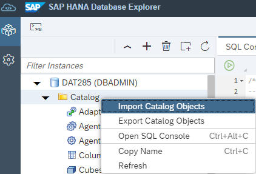
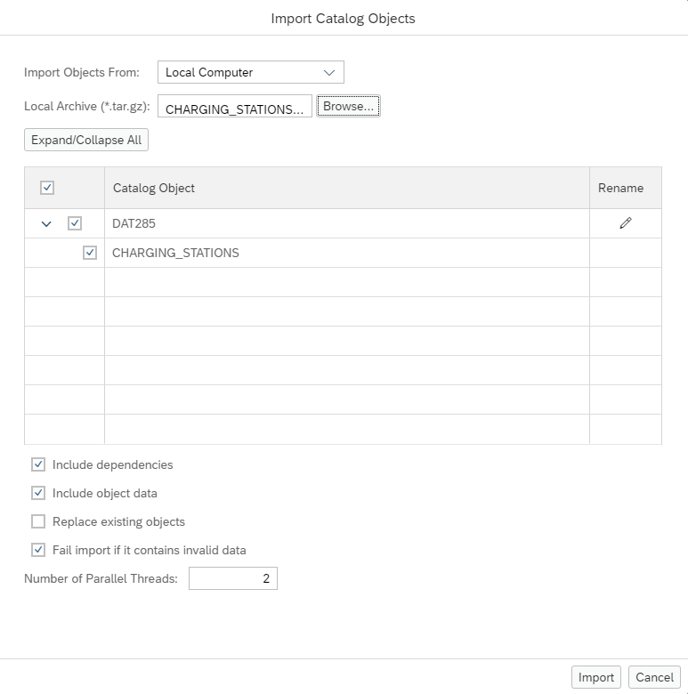
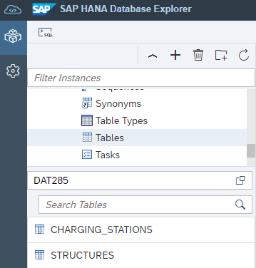
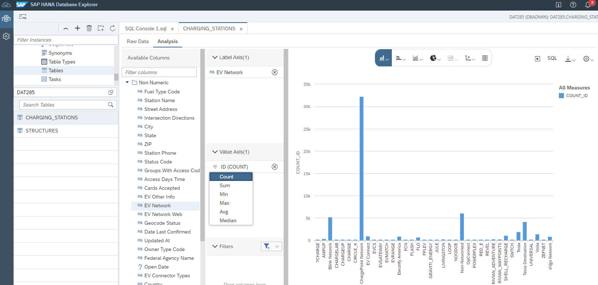
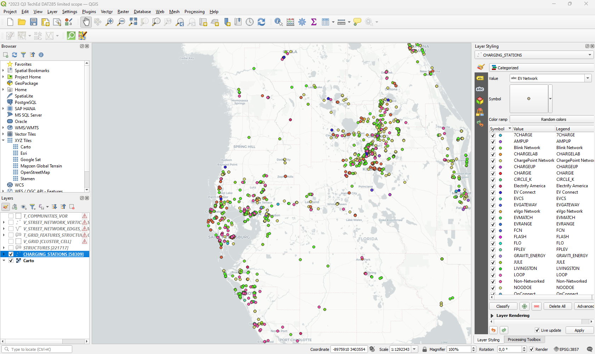
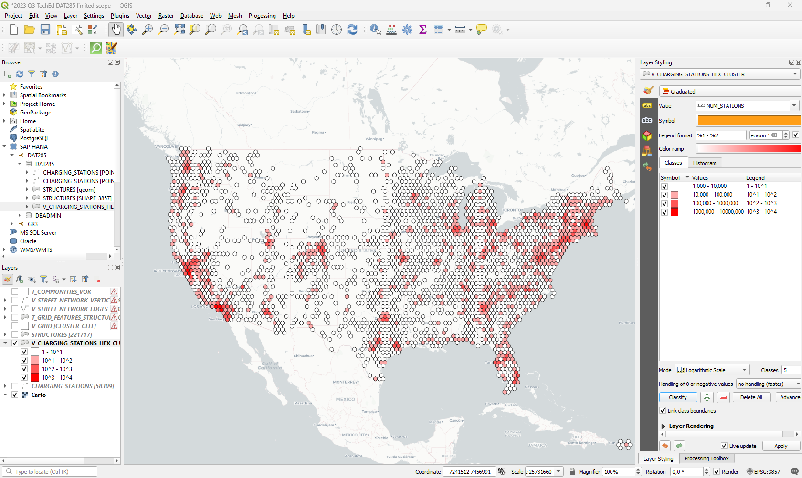
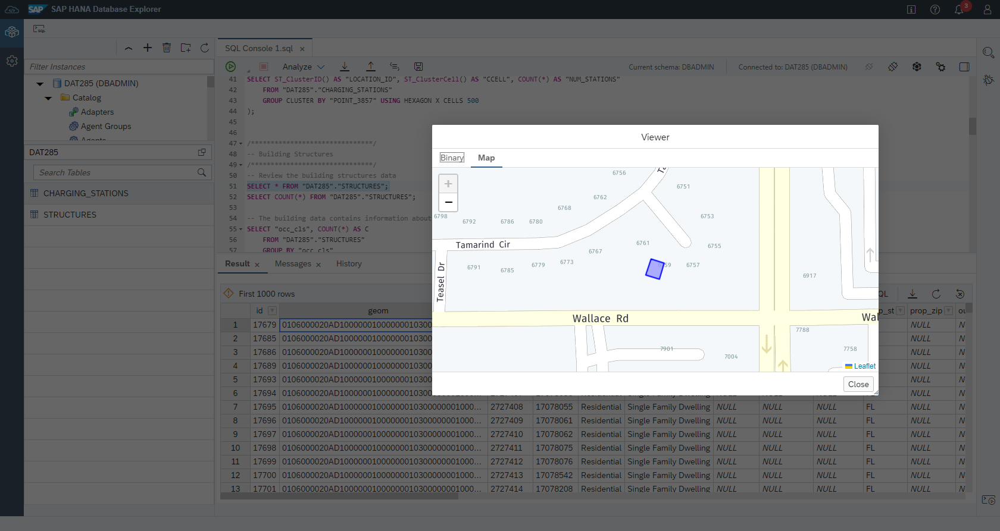
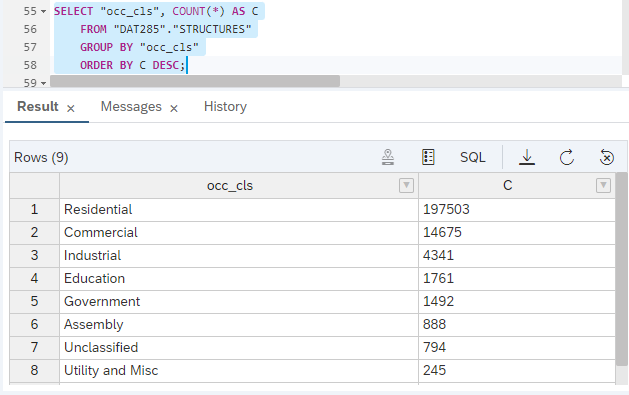
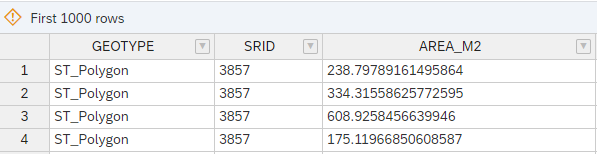
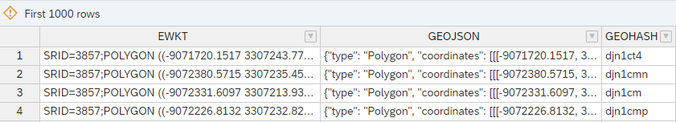

# Exercise 2 - Working with Spatial Data

In this exercise, we will analyse building structures and charging stations.
The building structures are sourced from the [FEMA Geospatial Ressource Center](https://gis-fema.hub.arcgis.com/pages/usa-structures) which provide geopackage files which can be opened in [QGIS](https://blogs.sap.com/2021/03/01/creating-a-playground-for-spatial-analytics/) and drag-and-dropped into SAP HANA. The charging station data is provided by the [National Renewable Energy Laboratory](https://www.nrel.gov/) as csv download or via an API.

For convenience, HANA table exports can be found in the [data folder](../../data/).

Before loading the data, create a schema (if you haven't already done so in exercise 1) and create the spatial reference system in which the building structures geometries are defined.

```SQL
CREATE SCHEMA "DAT285";

CREATE PREDEFINED SPATIAL REFERENCE SYSTEM IDENTIFIED BY 4269;
```

Load the table exports `CHARGING_STATIONS.tar.gz` and `BUILDING_STRUCTURES.tar.gz` via the Database Explorer. Right-click on "catalog" and choose "Import Catalog Objects".



In the following dialog, choose the `.tar.gz` file and hit "import".



You should now have the two tables `CHARGING_STATIONS` and `STRUCTURES` visible in Database Explorer.



## Exercise 2.1 Basic analysis of charging stations point data<a name="21"></a>

Let's review the data in the `CHARGING_STATIONS` table and create geometries from the `Latitude` and `Longitude` values.

```SQL
-- Review the charging stations data
SELECT * FROM "DAT285"."CHARGING_STATIONS";
SELECT COUNT(*) FROM "DAT285"."CHARGING_STATIONS";

-- The location is encoded in two columns: Latitude and Longitude
-- We will create a "real" geometries
ALTER TABLE "DAT285"."CHARGING_STATIONS" ADD ("POINT_4326" ST_GEOMETRY(4326));
ALTER TABLE "DAT285"."CHARGING_STATIONS" ADD ("POINT_3857" ST_GEOMETRY(3857));
UPDATE "DAT285"."CHARGING_STATIONS" SET "POINT_4326" = NEW ST_POINT("Longitude", "Latitude", 4326);
UPDATE "DAT285"."CHARGING_STATIONS" SET "POINT_3857" = "POINT_4326".ST_TRANSFORM(3857);
-- Convert the "open Date" string values to dates
ALTER TABLE "DAT285"."CHARGING_STATIONS" ALTER ("Open Date" DATE);
-- and add a primary key
ALTER TABLE "DAT285"."CHARGING_STATIONS" ADD PRIMARY KEY ("ID");
```

Now, right-click on the `CHARGING_STATIONS` table on the left hand side and select "Open Data" and then click on "Analyze". Drag "EV Network" to the "Label Axis", "ID" to the "Value Axis, and select "COUNT" as aggregation method.

"ChargePoint Network" runs by far the most charging stations.



We can now bring this data onto a map using [QGIS](../ex0/README.md#qgis).



```SQL
-- Let's run a basic spatial clustering to understand the spatial distribution of charging stations
SELECT ST_ClusterID() AS "LOCATION_ID", ST_ClusterCell() AS "CCELL", COUNT(*) AS "NUM_STATIONS"
	FROM "DAT285"."CHARGING_STATIONS"
	GROUP CLUSTER BY "POINT_3857" USING HEXAGON X CELLS 500;

-- To bring this data to QGIS, we will simply wrap a view around.
CREATE OR REPLACE VIEW "DAT285"."V_CHARGING_STATIONS_HEX_CLUSTER" AS (
SELECT ST_ClusterID() AS "LOCATION_ID", ST_ClusterCell() AS "CCELL", COUNT(*) AS "NUM_STATIONS"
	FROM "DAT285"."CHARGING_STATIONS"
	GROUP CLUSTER BY "POINT_3857" USING HEXAGON X CELLS 500
```

This is the result.



## Exercise 2.2 Analysis of building structures data

Noew, let's swtich to the `STRUCTURES` table. You can double-click a the "geom" value to view the building structure footprint on a map.

```sql
-- Review the building structures data
SELECT * FROM "DAT285"."STRUCTURES";
SELECT COUNT(*) FROM "DAT285"."STRUCTURES";
```



Let's take a look at the accupancy information which reveals building usage.

```SQL
-- The building data contains information about its use: Occupancy Classification
SELECT "occ_cls", COUNT(*) AS C
	FROM "DAT285"."STRUCTURES"
	GROUP BY "occ_cls"
	ORDER BY C DESC;
SELECT "prim_occ", COUNT(*) AS C
	FROM "DAT285"."STRUCTURES"
	GROUP BY "prim_occ"
	ORDER BY C DESC;
```

There are about 15k commercial buildings in the dataset.



Let's explore some spatial methods. We start with some "inspection" methods. The following statement show the geometry type, the spatial reference system of the spatial data, and the area of the building structure polygons.

```SQL
SELECT 
	"SHAPE_3857".ST_GeometryType() AS "GEOTYPE", 
	"SHAPE_3857".ST_SRID() AS "SRID", 
	"SHAPE_3857".ST_Area('meter') AS "AREA_M2", "SHAPE_3857" 
	FROM "DAT285"."STRUCTURES";
```



Next, let's review some "format conversion" methods. The following statement transforms the spatial data into ["EWKT"](https://en.wikipedia.org/wiki/Well-known_text_representation_of_geometry) (Extended Well-Known Text), ["GeoJSON"](https://en.wikipedia.org/wiki/GeoJSON), and ["GeoHash"](https://en.wikipedia.org/wiki/Geohash) format.

```SQL
SELECT 
	"SHAPE_3857".ST_AsEWKT() AS "EWKT", 
	"SHAPE_3857".ST_AsGeoJSON() AS "GEOJSON", 
	"SHAPE_3857".ST_TRANSFORM(4326).ST_GeoHash(10) AS "GEOHASH", 
	ST_GeomFromGeoHash("SHAPE_3857".ST_TRANSFORM(4326).ST_GeoHash(10), 4326) AS "GEO_FROM_GEOHASH", 
	"SHAPE_3857" 
	FROM "DAT285"."STRUCTURES";
```




## Summary

You've now ...

Continue to - [Exercise 3 - Analyze Networks](../ex3/README.md)
