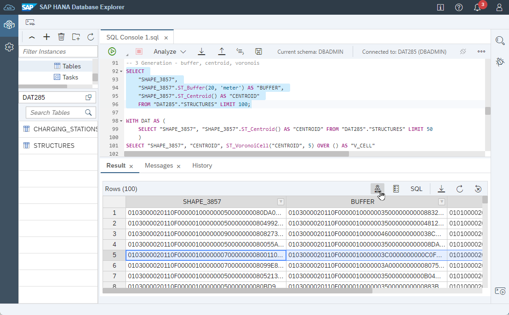
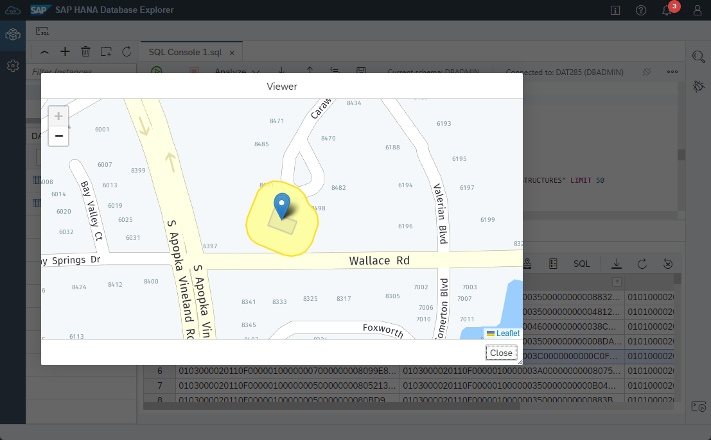
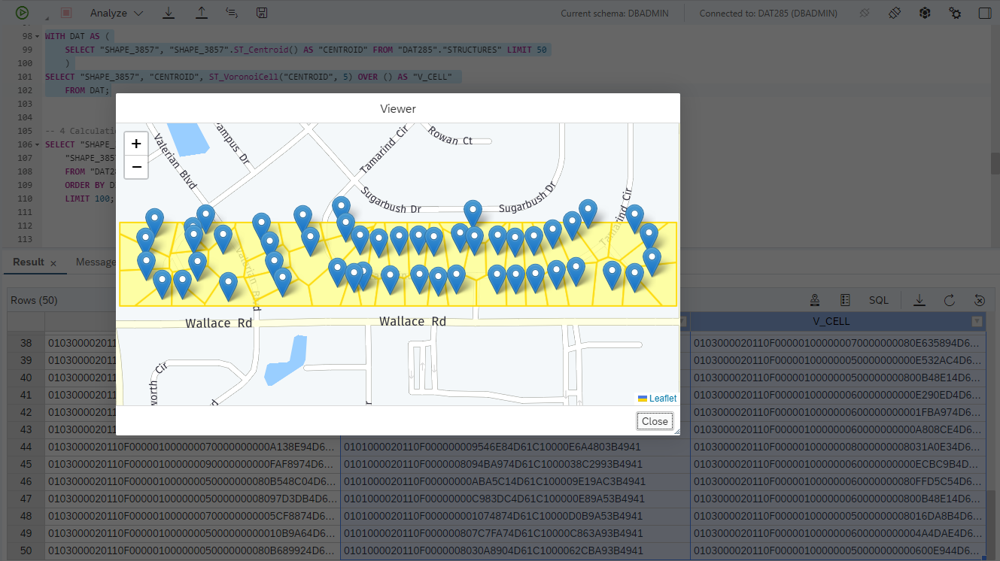
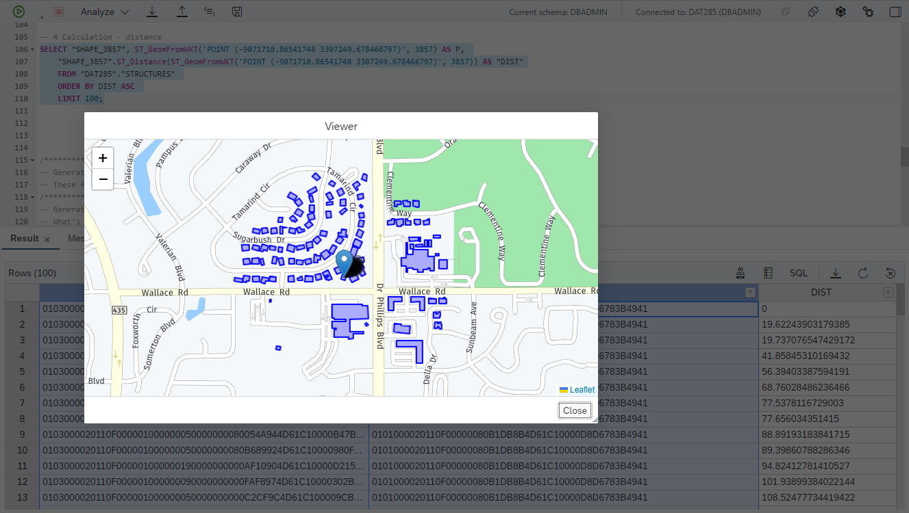
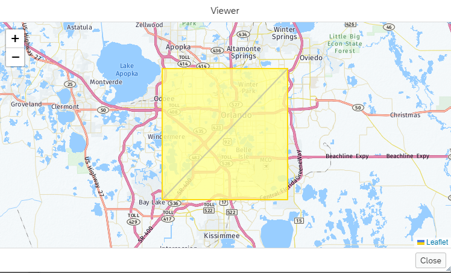
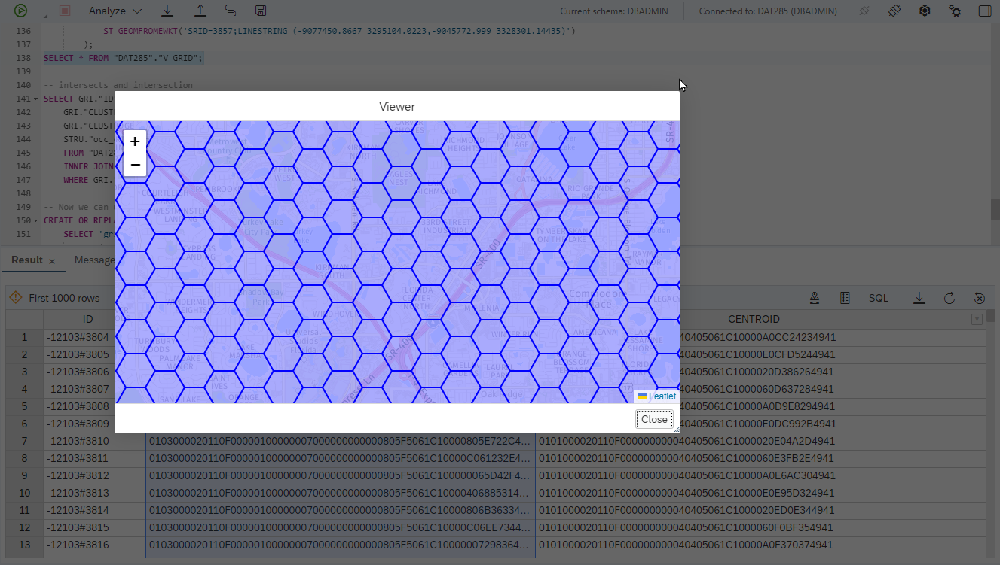
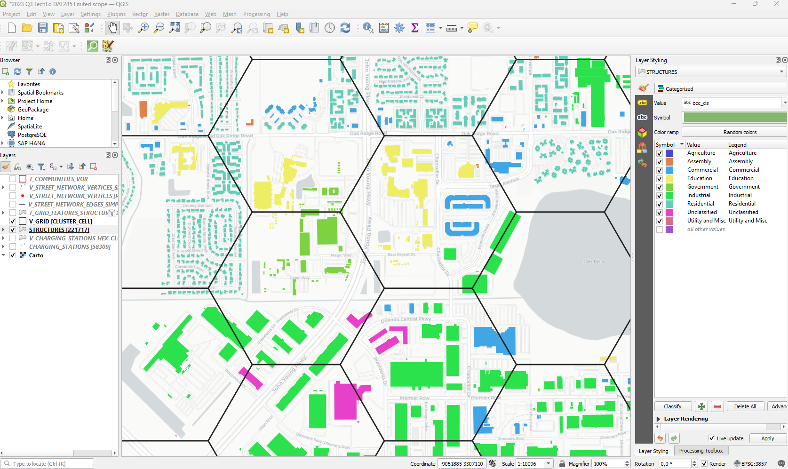
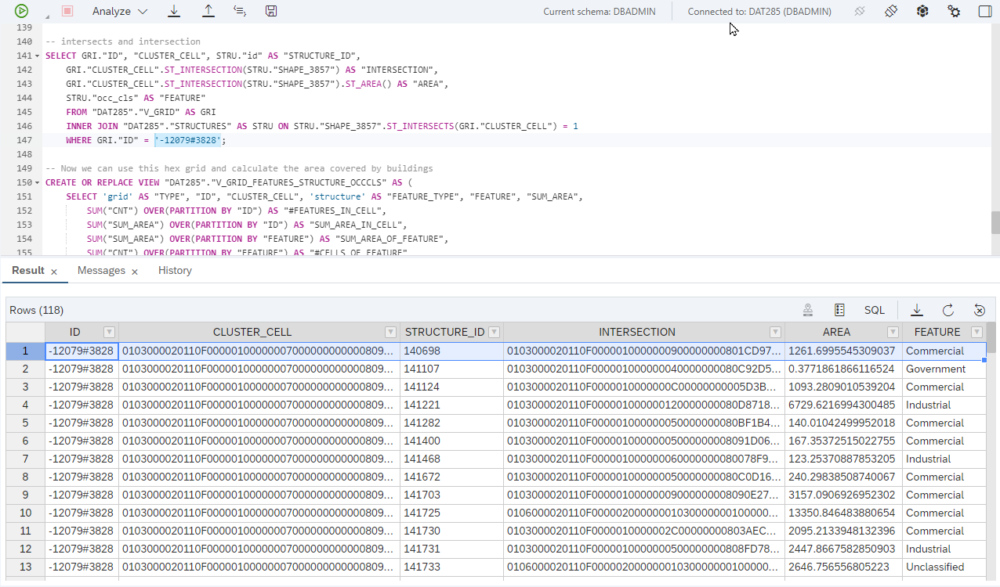
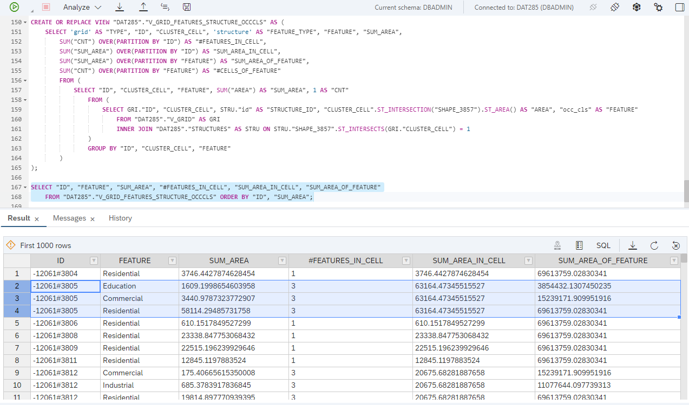

# Exercise 2 - Work with Spatial Data

In this exercise, we will analyse building structures and charging stations.
The building structures are sourced from the [FEMA Geospatial Ressource Center](https://gis-fema.hub.arcgis.com/pages/usa-structures) which provides geopackage files which can be opened in [QGIS](https://blogs.sap.com/2021/03/01/creating-a-playground-for-spatial-analytics/) and drag-and-dropped into SAP HANA. The charging station data is provided by the [National Renewable Energy Laboratory](https://www.nrel.gov/) as csv download or via an API.

For convenience, HANA table exports can be found in the [data folder](../../data/).

Before loading the data, create a schema (if you haven't already done so in exercise 1) and create the spatial reference system in which the building structures geometries are defined.

```SQL
CREATE SCHEMA "DAT285";

CREATE PREDEFINED SPATIAL REFERENCE SYSTEM IDENTIFIED BY 4269;
```

Load the table exports `CHARGING_STATIONS.tar.gz` and `BUILDING_STRUCTURES.tar.gz` via the Database Explorer. Right-click on "catalog" and choose "Import Catalog Objects".


In the following dialog, choose the `.tar.gz` file and hit "import".


You should now have the two tables `CHARGING_STATIONS` and `STRUCTURES` visible in Database Explorer.


## Exercise 2.1 Analysis of charging stations point data<a name="21"></a>

Let's review the data in the `CHARGING_STATIONS` table and create geometries from the `Latitude` and `Longitude` values using the `NEW ST_Point()` constructor.

```SQL
-- Review the charging stations data
SELECT * FROM "DAT285"."CHARGING_STATIONS";
SELECT COUNT(*) FROM "DAT285"."CHARGING_STATIONS";

-- The location is encoded in two columns: Latitude and Longitude
-- We will create a "real" geometries
ALTER TABLE "DAT285"."CHARGING_STATIONS" ADD ("POINT_4326" ST_GEOMETRY(4326));
ALTER TABLE "DAT285"."CHARGING_STATIONS" ADD ("POINT_3857" ST_GEOMETRY(3857));
UPDATE "DAT285"."CHARGING_STATIONS" SET "POINT_4326" = NEW ST_POINT("Longitude", "Latitude", 4326);
UPDATE "DAT285"."CHARGING_STATIONS" SET "POINT_3857" = "POINT_4326".ST_TRANSFORM(3857);
-- Convert the "open Date" string values to dates
ALTER TABLE "DAT285"."CHARGING_STATIONS" ALTER ("Open Date" DATE);
-- and add a primary key
ALTER TABLE "DAT285"."CHARGING_STATIONS" ADD PRIMARY KEY ("ID");
```

In the Database Explorer, right-click on the `CHARGING_STATIONS` table on the left hand side and select "Open Data" and then click on "Analyze". Drag "EV Network" to the "Label Axis", "ID" to the "Value Axis, and select "COUNT" as aggregation method.

"ChargePoint Network" runs by far the most charging stations.


We can now bring this data onto a map using [QGIS](../ex0/README.md#qgis).


Let's run a basic spatial clustering to understand the spatial distribution of charging stations. We use the `GROUP CLUSTER BY` clause - in this case configured to create hexagon clusters.

```SQL
SELECT ST_ClusterID() AS "LOCATION_ID", ST_ClusterCell() AS "CCELL", COUNT(*) AS "NUM_STATIONS"
	FROM "DAT285"."CHARGING_STATIONS"
	GROUP CLUSTER BY "POINT_3857" USING HEXAGON X CELLS 500;

-- To bring this data to QGIS, we will simply wrap a view around.
CREATE OR REPLACE VIEW "DAT285"."V_CHARGING_STATIONS_HEX_CLUSTER" AS (
SELECT ST_ClusterID() AS "LOCATION_ID", ST_ClusterCell() AS "CCELL", COUNT(*) AS "NUM_STATIONS"
	FROM "DAT285"."CHARGING_STATIONS"
	GROUP CLUSTER BY "POINT_3857" USING HEXAGON X CELLS 500
)
```

Again, we bring the view into QGIS and add some layer styling to color code the cluster cells by the number of charging stations. Note that since the clusters are exposed by a view (`V_CHARGING_STATIONS_HEX_CLUSTER`) we can easily make changes to the grid resolution by changing the configuraiton of the `X CELLS` value, e.g. from 500 -> 700. These changes are then immediatelly reflected in the QGIS fontend.


## Exercise 2.2 Analysis of building structures data<a name="22"></a>

Now, let's swtich to the `STRUCTURES` table. You can double-click a the "geom" value to view the building structure footprint on a map.

```sql
-- Review the building structures data
SELECT * FROM "DAT285"."STRUCTURES";
SELECT COUNT(*) FROM "DAT285"."STRUCTURES";
```


Let's take a look at the occupancy information which reveals building usage.

```SQL
-- The building data contains information about its use: Occupancy Classification
SELECT "occ_cls", COUNT(*) AS C
	FROM "DAT285"."STRUCTURES"
	GROUP BY "occ_cls"
	ORDER BY C DESC;
SELECT "prim_occ", COUNT(*) AS C
	FROM "DAT285"."STRUCTURES"
	GROUP BY "prim_occ"
	ORDER BY C DESC;
```

There are about 15k commercial buildings in the dataset.


Let's explore some spatial methods. We start with some "inspection" methods. The following statement shows the geometry type, the spatial reference system of the spatial data, and the area of the building structure polygons.

```SQL
SELECT 
	"SHAPE_3857".ST_GeometryType() AS "GEOTYPE", 
	"SHAPE_3857".ST_SRID() AS "SRID", 
	"SHAPE_3857".ST_Area('meter') AS "AREA_M2", "SHAPE_3857" 
	FROM "DAT285"."STRUCTURES";
```


Next, let's review some "format conversion" methods. The following statement transforms the spatial data into ["EWKT"](https://en.wikipedia.org/wiki/Well-known_text_representation_of_geometry) (Extended Well-Known Text), ["GeoJSON"](https://en.wikipedia.org/wiki/GeoJSON), and ["GeoHash"](https://en.wikipedia.org/wiki/Geohash) format.

```SQL
SELECT 
	"SHAPE_3857".ST_AsEWKT() AS "EWKT", 
	"SHAPE_3857".ST_AsGeoJSON() AS "GEOJSON", 
	"SHAPE_3857".ST_TRANSFORM(4326).ST_GeoHash(10) AS "GEOHASH", 
	ST_GeomFromGeoHash("SHAPE_3857".ST_TRANSFORM(4326).ST_GeoHash(10), 4326) AS "GEO_FROM_GEOHASH", 
	"SHAPE_3857" 
	FROM "DAT285"."STRUCTURES";
```


The above statement converts the spatial column only. There are also formats that comprise non-spatial attributes - EsriJSON and GeoJSON.

```SQL
WITH DAT AS (
	SELECT TO_INT("id") AS "ID", "occ_cls" AS "OCC_CLS", "SHAPE_3857" FROM "DAT285"."STRUCTURES" LIMIT 10
	)
SELECT 
	ST_AsEsriJSON("ID", "OCC_CLS", "SHAPE_3857".ST_TRANSFORM(4326) AS "SHAPE_4326", object_id_name => 'ID', coordinate_precision => 6, format => 'COMPACT') AS ESRI_JSON,
	ST_AsGeoJSON("ID", "OCC_CLS", "SHAPE_3857".ST_TRANSFORM(4326) AS "SHAPE_4326", feature_id_name => 'ID', coordinate_precision => 6, format => 'COMPACT') AS GEO_JSON
	FROM DAT;
```

For EsriJSON the result looks like this. Note that besides that actual geometry, the "ID" and "OCC_CLS" values are included as well.

```JSON
{
"objectIdFieldName": "ID", 
"geometryType": "esriGeometryPolygon", 
"spatialReference": {"wkid": 4326}, 
"fieldAliases": {"ID": "ID", "OCC_CLS": "OCC_CLS"}, 
"fields": [
{"name": "ID", "type": "esriFieldTypeOID", "alias": "ID"}, 
{"name": "OCC_CLS", "type": "esriFieldTypeString", "alias": "OCC_CLS", "length": 20}
], 
"features": [
{"geometry": {"rings": [[[-81.492649, 28.461183], [-81.492602, 28.46131], [-81.492482, 28.461276], [-81.492528, 28.461148], [-81.492649, 28.461183]]]}, "attributes": {"ID": 17679, "OCC_CLS": "Residential"}}, ...
```

Next, let's take a look at methods that "generate" new geometries. We will generate a 20 m buffer around the building structures using `ST_Buffer()` and calculate the centroid of the building polygon via `ST_Centroid()`.

```SQL
SELECT 
	"SHAPE_3857", 
	"SHAPE_3857".ST_Buffer(20, 'meter') AS "BUFFER", 
	"SHAPE_3857".ST_Centroid() AS "CENTROID" 
	FROM "DAT285"."STRUCTURES" LIMIT 100;
```

In DBX, you can mark multiple values and click on the view spatial data button to bring up a map. The yellow area is the 20 m buffer, the point marker indicates the building's centroid.




Next, we will calulate [Voronoi cells](https://en.wikipedia.org/wiki/Voronoi_diagram) based on the centroids.
Each resulting (yellow) polygon consists of all points that are closer to its seed (the centroid) than to any other.

```SQL
WITH DAT AS (
	SELECT "SHAPE_3857", "SHAPE_3857".ST_Centroid() AS "CENTROID" FROM "DAT285"."STRUCTURES" LIMIT 50
	)
SELECT "SHAPE_3857", "CENTROID", ST_VoronoiCell("CENTROID", 5) OVER () AS "V_CELL" 
	FROM DAT;
```



At last, we will run a "calculation" method: `ST_Distance`. Using the statement below, a point "P" is generated, the distances from P to any structures is calulated, and the clostest 100 buildings are returned.

```SQL
SELECT "SHAPE_3857", 
	ST_GeomFromWKT('POINT (-9071710.86541748 3307249.678466797)', 3857) AS P,
	"SHAPE_3857".ST_Distance(ST_GeomFromWKT('POINT (-9071710.86541748 3307249.678466797)', 3857)) AS "DIST"
	FROM "DAT285"."STRUCTURES" 
	ORDER BY DIST ASC 
	LIMIT 100;
```



## Exercise 2.3 Calculate spatial features from building structures<a name="23"></a>

In this exercise we will use the building structures data to derive location characteristics which we can use in classic machine learning tasks like clustering and classification. We will first generate a hexagon grid that covers our area of interest. For each grid cell, we look at the buildings and sum up their area. This allows us to calculate the ratio of the covered area by occupancy class to the total building area.

So, let's first get the total extent of our building structures data. We use `ST_EnvelopeAggr()` method to derive the bounding rectangle and then extract the minimum and maximum of the X and Y coordinate of the rectangle. The coordinates are then used to generate a line from the "lower left" to the "upper right" corner of the rectangle.

```SQL
SELECT "P1".ST_MAKELINE("P2") AS "LINE_3857", 
	"P1".ST_MAKELINE("P2").ST_TRANSFORM(4326) AS "LINE_4326", 
	"ENV" AS "RECT_3857", 
	ENV.ST_TRANSFORM(4326) AS "RECT_4326" FROM (
		SELECT NEW ST_POINT("ENV".ST_XMIN(), "ENV".ST_YMIN(), 3857) AS "P1", NEW ST_POINT("ENV".ST_XMAX(), "ENV".ST_YMAX(), 3857) AS "P2", "ENV" FROM (
			SELECT ST_EnvelopeAggr("SHAPE_3857") AS "ENV" FROM "DAT285"."STRUCTURES"
	)
);
```

Below we see the bounding rectangle (yellow) and the diagonal line (blue).



We can now take the value of "LINE_3857" to generate a hexagon grid that coveres our area of interest. The `ST_HexagonGrid()` generation function returns the cluster cell's polygon as well as the centroid. The query is wrapped in a view so we can use it in subsequent calculations.

```SQL
CREATE OR REPLACE VIEW "DAT285"."V_GRID" AS
	SELECT "I"||'#'||"J" AS "ID", "GEOM" AS "CLUSTER_CELL", GEOM.ST_CENTROID() AS "CENTROID" 
		FROM ST_HexagonGrid(
			500, 
			'VERTICAL', 
			ST_GEOMFROMEWKT('SRID=3857;LINESTRING (-9077450.8667 3295104.0223,-9045772.999 3328301.14435)')
		);

SELECT * FROM "DAT285"."V_GRID";
```



We can now identify the structures that intersect with the grid cells and calculate the intersections and the area of the buildings that are inside the grid cell. This map depicts the idea.



```SQL
SELECT GRI."ID", "CLUSTER_CELL", STRU."id" AS "STRUCTURE_ID", 
	GRI."CLUSTER_CELL".ST_INTERSECTION(STRU."SHAPE_3857") AS "INTERSECTION", 
	GRI."CLUSTER_CELL".ST_INTERSECTION(STRU."SHAPE_3857").ST_AREA() AS "AREA", 
	STRU."occ_cls" AS "FEATURE"
	FROM "DAT285"."V_GRID" AS GRI
	INNER JOIN "DAT285"."STRUCTURES" AS STRU ON STRU."SHAPE_3857".ST_INTERSECTS(GRI."CLUSTER_CELL") = 1
	WHERE GRI."ID" = '-12079#3828';
```

For the grid cell with the ID '-12079#3828', we see that 1261 square meters of the commercial building structure 140698 is inside the grid cell.



Let's wrap this calculation in a view and use some window functions to get the totals for each grid cell.

```SQL
CREATE OR REPLACE VIEW "DAT285"."V_GRID_FEATURES_STRUCTURE_OCCCLS" AS ( 
	SELECT 'grid' AS "TYPE", "ID", "CLUSTER_CELL", 'structure' AS "FEATURE_TYPE", "FEATURE", "SUM_AREA",
		SUM("CNT") OVER(PARTITION BY "ID") AS "#FEATURES_IN_CELL",
		SUM("SUM_AREA") OVER(PARTITION BY "ID") AS "SUM_AREA_IN_CELL",
		SUM("SUM_AREA") OVER(PARTITION BY "FEATURE") AS "SUM_AREA_OF_FEATURE",
		SUM("CNT") OVER(PARTITION BY "FEATURE") AS "#CELLS_OF_FEATURE"
		FROM (
			SELECT "ID", "CLUSTER_CELL", "FEATURE", SUM("AREA") AS "SUM_AREA", 1 AS "CNT"
				FROM (
					SELECT GRI."ID", "CLUSTER_CELL", STRU."id" AS "STRUCTURE_ID", "CLUSTER_CELL".ST_INTERSECTION("SHAPE_3857").ST_AREA() AS "AREA",	"occ_cls" AS "FEATURE"
						FROM "DAT285"."V_GRID" AS GRI
						INNER JOIN "DAT285"."STRUCTURES" AS STRU ON STRU."SHAPE_3857".ST_INTERSECTS(GRI."CLUSTER_CELL") = 1
				)
				GROUP BY "ID", "CLUSTER_CELL", "FEATURE"
		)
);

SELECT "ID", "FEATURE", "SUM_AREA", "#FEATURES_IN_CELL", "SUM_AREA_IN_CELL", "SUM_AREA_OF_FEATURE"
	FROM "DAT285"."V_GRID_FEATURES_STRUCTURE_OCCCLS" ORDER BY "ID", "SUM_AREA";
```

Looking at the result, we see that grid cell '-12061#3805' covers three types of building structures:
- educational buildings cover ~1.600 m2
- commercial buildings cover ~3.400 m2
- residential buildings cover ~58.000 m2

This sums up to ~63.000 m2 of building structure area in that cell. The last column contains the total area of structures by occupancy class for the whole dataset. This data describes a "usage type" of the individual areas. We see grid cells that mainly contain commercial buildings, and cells that have a high share of residential structures. This data can be use to derive landuse classes - which is what we'll do in exercise 4.



Since the above query takes a couple of seconds to run, we will persist the results in a table for later use.

```SQL
CREATE TABLE "DAT285"."T_GRID_FEATURES_STRUCTURE_OCCCLS" AS (
	SELECT * FROM "DAT285"."V_GRID_FEATURES_STRUCTURE_OCCCLS"
);
```

## Summary

We have seen how to work with spatial data - points and polygons - and how to run some basic spatial queries, including transformation and calulation methods.

Continue to - [Exercise 3 - Analyze Networks](../ex3/README.md)
