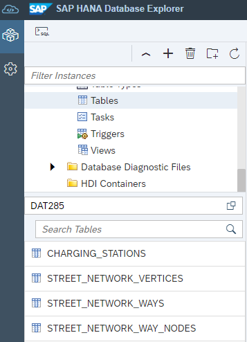
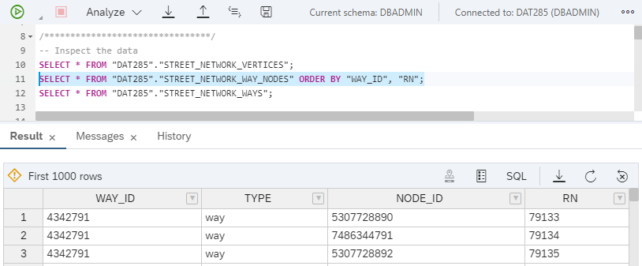
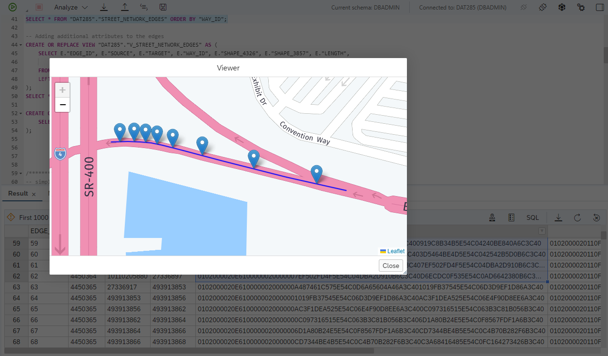
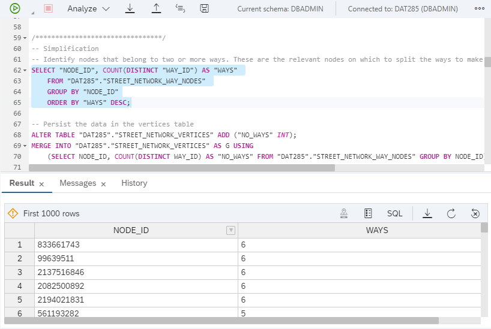
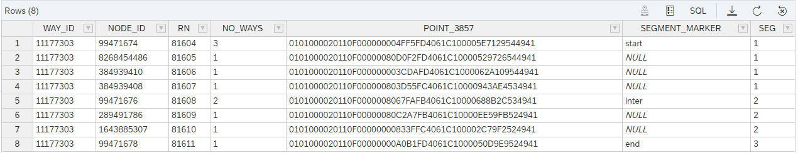
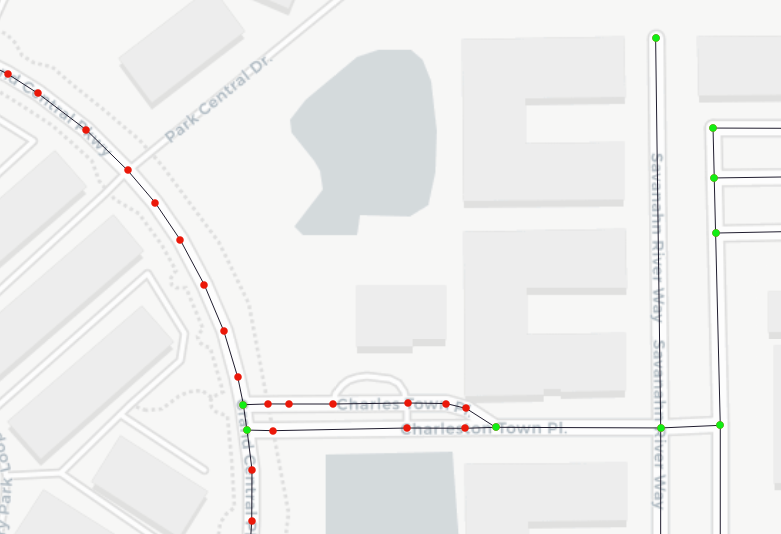
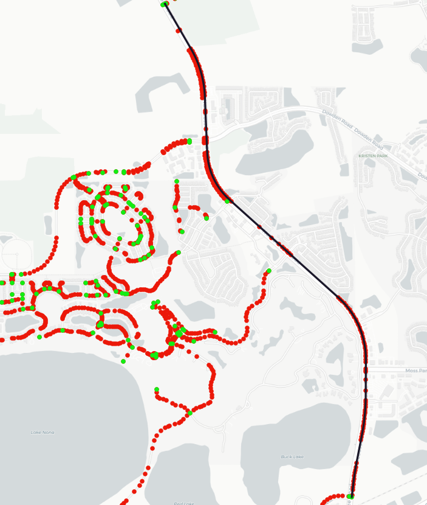
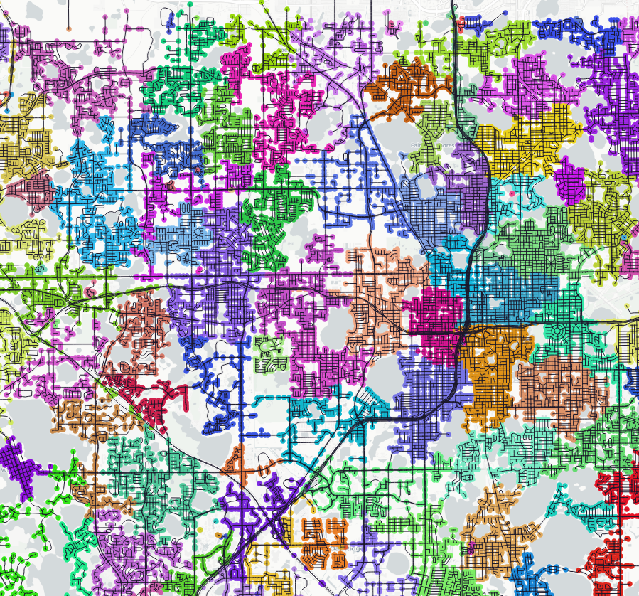

# Exercise 3 - Analyze Networks

In this exercise, we will work with street network data. First, we will "simplify" the data by removing unneccessary vertices. Then we will create a `GRAPH WORKSPACE` to expose the relational data to the SAP HANA Graph engine and run a community detection algorithm.

If you ran exercise 1, you should already have the required tables in your system: `STREET_NETWORK_VERICES`, `STREET_NETWORK_WAYS`, and `STREET_NETWORK_WAY_NODES`.

If you run on a SAP HANA Cloud free tier or trial system, you had to skip exercise 1. In this case, you'll import the required data during exercise 3.1.

## Exercise 3.1 Import OSM Street Network Data<a name="31"></a>

Follow the same approach described in exercise 2 and use the Database Explorer to import `STREET_NETWORK.tar.gz`. You should then see the three street network tables in the catalog browser.



## Exercise 3.2 Simplify the Data and create a Graph from OSM Street Network Data<a name="32"></a>

Let's inspect the data. The `STREET_NETWORK_VERTICES` table contains the point geometries that make up a street. The `STREET_NETWORK_WAY_NODES` contains an ordered set of nodes that make up a street. Finally, the `STREET_NETWORK_WAYS` table provides some additional attributes of the streets, like the street type ("HW") and the name of the street. For more details refer to exercise 1.

```SQL
SELECT * FROM "DAT285"."STREET_NETWORK_VERTICES";
SELECT * FROM "DAT285"."STREET_NETWORK_WAY_NODES" ORDER BY "WAY_ID", "RN";
SELECT * FROM "DAT285"."STREET_NETWORK_WAYS";
```



We will now connect sequential pairs of way nodes (e.g. the first and the second in the table above) to make up an edge for our graph. Technically, we will join the data from `STREET_NETWORK_WAY_NODES` to itself, using the row number sequence ("RN") in a join condition. For each pair of sequential nodes, we also create a linestring geometry using `ST_MakeLine()`. The resulting edges are stored in the table `STREET_NETWORK_EDGES`.

```SQL
-- Create edges from the waypoints
CREATE TABLE "DAT285"."STREET_NETWORK_EDGES"(
	"EDGE_ID" BIGINT GENERATED ALWAYS AS IDENTITY PRIMARY KEY,
	"WAY_ID" BIGINT,
	"SOURCE" BIGINT NOT NULL,
	"TARGET" BIGINT NOT NULL,
	"SHAPE_4326" ST_GEOMETRY(4326),
	"SHAPE_3857" ST_GEOMETRY(3857),
	"LENGTH" DOUBLE
);

INSERT INTO "DAT285"."STREET_NETWORK_EDGES" ("WAY_ID", "SOURCE", "TARGET", "SHAPE_4326", "SHAPE_3857", "LENGTH")
WITH "CANDIDATES" AS (
	SELECT N.*, GEOM."POINT_4326", GEOM."POINT_3857"
		FROM "DAT285"."STREET_NETWORK_WAY_NODES" AS N -- the way nodes are ordered by ROW NUMBER RN
		LEFT JOIN "DAT285"."STREET_NETWORK_VERTICES" AS GEOM ON N.NODE_ID = GEOM.NODE_ID -- the street vertices contain the geometry
	)
	SELECT N1."WAY_ID" AS "WAY_ID", N1."NODE_ID" AS "SOURCE", N2."NODE_ID" AS "TARGET", 
		ST_MAKELINE(N1."POINT_4326", N2."POINT_4326") AS "SHAPE_4326",
		ST_MAKELINE(N1."POINT_3857", N2."POINT_3857") AS "SHAPE_3857",
		ST_MAKELINE(N1."POINT_3857", N2."POINT_3857").ST_LENGTH('meter') AS "LENGTH"
		FROM "CANDIDATES" AS N1
		INNER JOIN "CANDIDATES" AS N2 ON N1."WAY_ID" = N2."WAY_ID" AND N1.RN + 1 = N2.RN -- joining the candidates wiht themselves using the row number
		ORDER BY "WAY_ID";

SELECT * FROM "DAT285"."STREET_NETWORK_EDGES" ORDER BY "WAY_ID";
```

If we look at the edges of a way, the linestring geometries make up a street. Notice that some of the vertices are just there to bend the street around a curve - they are not real road intersections. We'll remove these vertices in a "simplification" step.



Before we run simplification, we'll just join some attributes from the `STREET_NETWORK_WAYS` table to our edges.

```SQL
-- Adding additional attributes to the edges
CREATE OR REPLACE VIEW "DAT285"."V_STREET_NETWORK_EDGES" AS ( 	
	SELECT E."EDGE_ID", E."SOURCE", E."TARGET", E."WAY_ID", E."SHAPE_4326", E."SHAPE_3857", E."LENGTH", 
		W."TYPE", W."HW", W."NAME", W."ONEWAY", W."MAXSPEED"
	FROM "DAT285"."STREET_NETWORK_EDGES" AS E
	LEFT JOIN "DAT285"."STREET_NETWORK_WAYS" AS W ON E."WAY_ID" = W."WAY_ID"
);
SELECT * FROM "DAT285"."V_STREET_NETWORK_EDGES";

CREATE OR REPLACE VIEW "DAT285"."V_STREET_NETWORK_VERTICES" AS (
	SELECT * FROM "DAT285"."STREET_NETWORK_VERTICES" 
);
```

To simplify the network, we remove all vertices from the street network that do not belong to two or more ways, i.e. vertices which are not intersections/junctions. The vertices which belong to just one way, are used only to bend the street around a curve. By removing the unneccessary vertices we will not change the general topology of the network.

So, let's start and calculate the number of distinct ways a node belongs to.

```SQL
SELECT "NODE_ID", COUNT(DISTINCT "WAY_ID") AS "WAYS" 
	FROM "DAT285"."STREET_NETWORK_WAY_NODES" 
	GROUP BY "NODE_ID"
	ORDER BY "WAYS" DESC;
```

Some of the nodes belong to 6 different ways/streets.



We will persist this information in our `STREET_NETWORK_VERTICES` table so we can later easily identify vertices that can be removed.

```SQL
-- Persist the data in the vertices table
ALTER TABLE "DAT285"."STREET_NETWORK_VERTICES" ADD ("NO_WAYS" INT);
MERGE INTO "DAT285"."STREET_NETWORK_VERTICES" AS G USING
	(SELECT NODE_ID, COUNT(DISTINCT WAY_ID) AS "NO_WAYS" FROM "DAT285"."STREET_NETWORK_WAY_NODES" GROUP BY NODE_ID) AS N
	ON G.NODE_ID = N.NODE_ID
	WHEN MATCHED THEN UPDATE SET G.NO_WAYS = N.NO_WAYS;
```

Next, we will create a table to store the simplified edges and insert data from the "simplification" query. The basic logic of the query is to keep just these nodes of a way which are either start or end node of a way, or which are junctions. These nodes are marked with 'start', 'end', or 'inter'. The way segments between 'start' and 'inter', 'inter' and 'inter, and 'inter' and 'end' are enumerated with a "SEG"ment counter. A new linsestring is generated using `ST_MakeLineAggr()` on points making up a segment. And finally, the segments and the waypoints are joined.

The "CANDIDATES" defined the SQL statement of the "Simplification query" below yields the data structure on which subsequent operations are based. Let's take a look at this intermediate data structure.


We see
- WAY_ID 11177303 is comprises 8 nodes
- NODE_ID 99471674 is the start node of the way
    -  it joins 3 ways
- NODE_ID 99471676 is an intermediate node
    - it joins 2 ways
- NODE_ID99471678 is an end node
    - it is a dead end

All other nodes of this way are neither junction, nor the start of end of this way. These nodes can be removed.

```SQL
-- Create a table to store the new, simplified edges
CREATE TABLE "DAT285"."STREET_NETWORK_EDGES_SIMPLIFIED"(
	"EDGE_ID" BIGINT GENERATED ALWAYS AS IDENTITY PRIMARY KEY,
	"WAY_ID" BIGINT,
	"SOURCE" BIGINT NOT NULL,
	"TARGET" BIGINT NOT NULL,
	"SHAPE_4326" ST_GEOMETRY(4326),
	"SHAPE_3857" ST_GEOMETRY(3857),
	"LENGTH" DOUBLE
);

-- Simplification query
INSERT INTO "DAT285"."STREET_NETWORK_EDGES_SIMPLIFIED" ("WAY_ID", "SOURCE", "TARGET", "SHAPE_4326", "SHAPE_3857", "LENGTH")
WITH "CANDIDATES" AS (
	SELECT *, COUNT("SEGMENT_MARKER") OVER (PARTITION BY "WAY_ID" ORDER BY RN ASC) AS "SEG" FROM (
		SELECT N.*, GEOM."NO_WAYS", GEOM."POINT_4326", GEOM."POINT_3857",
			CASE 
				WHEN LAG(N.NODE_ID, 1) OVER(PARTITION BY N.WAY_ID ORDER BY RN ASC) IS NULL THEN 'start'
				WHEN LEAD(N.NODE_ID, 1) OVER(PARTITION BY N.WAY_ID ORDER BY RN ASC) IS NULL THEN 'end' 
				WHEN GEOM.NO_WAYS > 1 THEN 'inter' END AS "SEGMENT_MARKER"
			FROM "DAT285"."STREET_NETWORK_WAY_NODES" AS N
			INNER JOIN "DAT285"."STREET_NETWORK_VERTICES" AS GEOM ON N."NODE_ID" = GEOM."NODE_ID"
		)
	),
	"SEGMENTS" AS (
		SELECT "WAY_ID", "SEG", ST_MAKELINEAGGR("POINT_4326" ORDER BY RN ASC) AS "LINE_4326", ST_MAKELINEAGGR("POINT_3857" ORDER BY RN ASC) AS "LINE_3857" 
			FROM "CANDIDATES" GROUP BY "WAY_ID", "SEG"
	),
	"WAYPOINTS" AS (SELECT * FROM "CANDIDATES" WHERE "SEGMENT_MARKER" IS NOT NULL) 
SELECT N1."WAY_ID", N1."NODE_ID" AS "SOURCE", N2."NODE_ID" AS "TARGET", 
		S.LINE_4326.ST_ADDPOINT(N2."POINT_4326", -1) AS "LINE_4326",
		S.LINE_3857.ST_ADDPOINT(N2."POINT_3857", -1) AS "LINE_3857", 
		S.LINE_3857.ST_ADDPOINT(N2."POINT_3857", -1).ST_LENGTH('meter') AS "LENGTH"
	FROM "WAYPOINTS" AS N1
	LEFT JOIN "SEGMENTS" AS S ON N1."WAY_ID" = S."WAY_ID" AND N1."SEG" = S."SEG"
	INNER JOIN "WAYPOINTS" AS N2 ON N1."WAY_ID" = N2."WAY_ID" AND N1."SEG" + 1 = N2."SEG"
	ORDER BY N1."WAY_ID", N1."RN"
;
```

The following map provides a visual illustration of the approach. The red nodes are removed during simplification, leaving only the green nodes (road junctions, start or end nodes). The simplified edges are running between green nodes.



If we evaluate our network, we see a substantial reduction of complexity. Way 991152375 - the black line below - comprises 123 edges originally (between the red nodes). After simplification, there are two edges left (between the green nodes). Again, without changing the topology of or network.

```SQL
SELECT * FROM "DAT285"."STREET_NETWORK_EDGES" WHERE "WAY_ID" = 991152375;
SELECT * FROM "DAT285"."STREET_NETWORK_EDGES_SIMPLIFIED" WHERE "WAY_ID" = 991152375;
```



Let's now add a flag to our vertices to indicated if they are part of our new simplified network and create two new views on top for easy consumption.

```SQL
-- Add a flag if node appears in the edges_simplified table
ALTER TABLE "DAT285"."STREET_NETWORK_VERTICES" ADD("EDGE_SIMPLIFIED_RELEVANT" BOOLEAN DEFAULT FALSE);
UPDATE "DAT285"."STREET_NETWORK_VERTICES"
	SET "EDGE_SIMPLIFIED_RELEVANT" = TRUE 
	WHERE NODE_ID IN (SELECT "SOURCE" FROM "DAT285"."STREET_NETWORK_EDGES_SIMPLIFIED")
		OR NODE_ID IN (SELECT "TARGET" FROM "DAT285"."STREET_NETWORK_EDGES_SIMPLIFIED");

-- create a simplified edges view
CREATE OR REPLACE VIEW "DAT285"."V_STREET_NETWORK_EDGES_SIMPLIFIED" AS ( 	
	SELECT E."EDGE_ID", E."SOURCE", E."TARGET", E."WAY_ID", E."SHAPE_4326", E."SHAPE_3857", E."LENGTH", W."TYPE", W."HW", W."NAME", W."ONEWAY", W."MAXSPEED"
	FROM "DAT285"."STREET_NETWORK_EDGES_SIMPLIFIED" AS E
	LEFT JOIN "DAT285"."STREET_NETWORK_WAYS" AS W ON E."WAY_ID" = W."WAY_ID"
);
-- create a simplified vertices view
CREATE OR REPLACE VIEW "DAT285"."V_STREET_NETWORK_VERTICES_SIMPLIFIED" AS (
	SELECT * FROM "DAT285"."STREET_NETWORK_VERTICES" 
	WHERE "EDGE_SIMPLIFIED_RELEVANT" = TRUE 
);

SELECT COUNT(*) FROM "DAT285"."V_STREET_NETWORK_VERTICES";
SELECT COUNT(*) FROM "DAT285"."V_STREET_NETWORK_VERTICES_SIMPLIFIED";
SELECT COUNT(*) FROM "DAT285"."V_STREET_NETWORK_EDGES";
SELECT COUNT(*) FROM "DAT285"."V_STREET_NETWORK_EDGES_SIMPLIFIED";
```

The last four statements above reveal the total complexity reduction.
- number of vertices is down to 38k (from 150k)
- number of edges is down to 50k (from 160k)

## Exercise 3.3 Network Analysis - Community Detection<a name="33"></a>

Now that we have a simplified network, we will create a `GRAPH WORKSPACE` on top and run some network analysis. The `GRAPH WORKSPACE` tells the SAP HANA Graph engine which edges and vertices make up your network. It's like a SQL view on your data.

```SQL
CREATE OR REPLACE GRAPH WORKSPACE "DAT285"."STREET_NETWORK_GRAPH_SIMPLIFIED"
	EDGE TABLE "DAT285"."V_STREET_NETWORK_EDGES_SIMPLIFIED"
		SOURCE COLUMN "SOURCE"
		TARGET COLUMN "TARGET"
		KEY COLUMN "EDGE_ID"
	VERTEX TABLE "DAT285"."V_STREET_NETWORK_VERTICES_SIMPLIFIED"
		KEY COLUMN "NODE_ID";
```

The `GRAPH WORKSPACE` is required to run GraphScript procedures on your network. We want to identify communities in the street network. The below procedure runs the ["Louvain"](https://en.wikipedia.org/wiki/Louvain_method) algorithm that optimizes modularity. Simply put, it identifies partitions in which the vertices within one partition are well connected (many edges), but vertices of different partitions are less so.

The below script first calculated the maximum length of the edges (8382m). We use this value to define the edge "weight" (1.0 - "LENGTH"/8400.0), which is used in the `COMMUNITIES_LOUVAIN` algorithm of the `GS_COMMUNITY` procedure. The procedure map each vertex to a community and returns the result in table format.
Each vertex' community is added to the `STREET_NETWORK_VERTICES` table.


```SQL
/*************************/
-- Run community detection
/*************************/
SELECT "LENGTH" FROM "DAT285"."STREET_NETWORK_EDGES_SIMPLIFIED" ORDER BY "LENGTH" DESC;

-- Create a GraphScript procedure to run Louvain community detection
CREATE OR REPLACE PROCEDURE "DAT285"."GS_COMMUNITY" (
	OUT o_res TABLE("NODE_ID" BIGINT, "COMM" BIGINT)
)
LANGUAGE GRAPH READS SQL DATA AS
BEGIN
	Graph g = Graph("DAT285","STREET_NETWORK_GRAPH_SIMPLIFIED");
	SEQUENCE<MULTISET<VERTEX>> communities = COMMUNITIES_LOUVAIN(:g, 1, (Edge e) => DOUBLE{ return 1.0 - :e."LENGTH"/8400.0; } );
	MAP<VERTEX, BIGINT> communityMap = TO_ORDINALITY_MAP(:communities);
	o_res = SELECT :v."NODE_ID", :communityMap[:v] FOREACH v in VERTICES(:g);
END;
CALL "DAT285"."GS_COMMUNITY"(?);

-- Add the community information to the vertex table
ALTER TABLE "DAT285"."STREET_NETWORK_VERTICES" ADD ("COMM" BIGINT);
DO()
BEGIN
	CALL "DAT285"."GS_COMMUNITY"(o_res);
	MERGE INTO "DAT285"."STREET_NETWORK_VERTICES" AS DAT
		USING :o_res AS UPD ON DAT.NODE_ID = UPD.NODE_ID
		WHEN MATCHED THEN UPDATE SET DAT."COMM" = UPD."COMM";
END;

-- Rebuild view
CREATE OR REPLACE VIEW "DAT285"."V_STREET_NETWORK_VERTICES_SIMPLIFIED" AS (
	SELECT * FROM "DAT285"."STREET_NETWORK_VERTICES" 
	WHERE "EDGE_SIMPLIFIED_RELEVANT" = TRUE 
);
```

We can now inspect the communities.

```SQL
-- How many communities are in our street network?
SELECT COUNT(DISTINCT "COMM") FROM "DAT285"."V_STREET_NETWORK_VERTICES_SIMPLIFIED";
-- what's the size of the communities?
SELECT "COMM", COUNT(*) AS C 
	FROM "DAT285"."V_STREET_NETWORK_VERTICES_SIMPLIFIED"
	GROUP BY "COMM" ORDER BY C DESC;
```

You may find about 200 communities in your graph, in which the largest community comprises ~750 vertices.

If we plot the vertices on a map and color-code by community we see that the street network is nicely partitioned into subgraphs. These subgraph usually reflect some kind of neighborhood - there are many connections within a neighborhood, but less connections between neighborhoods.




## Summary

We simplified a street network using SQL and created a `GRAPH WORKSPACE` on top. A GraphScript procedure was used to run a community detection algorithm.

Continue to - [Exercise 4 - Machine Learning](../ex4/README.md)
