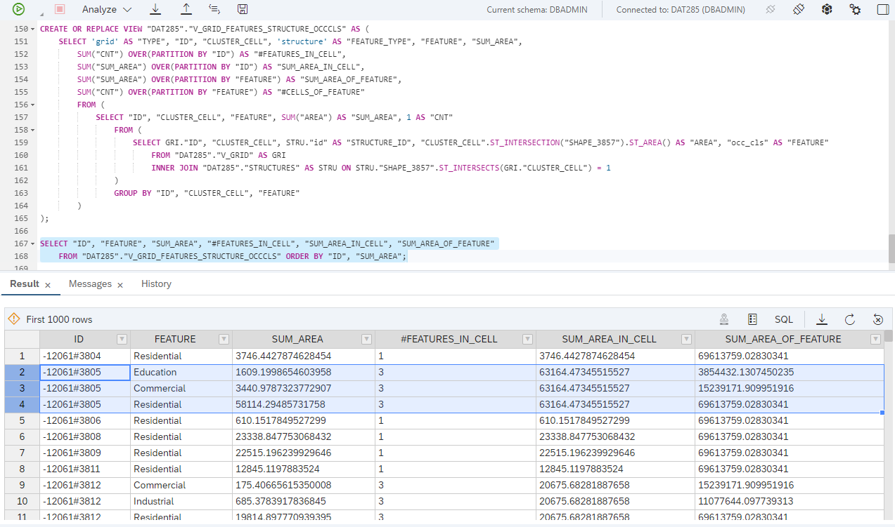
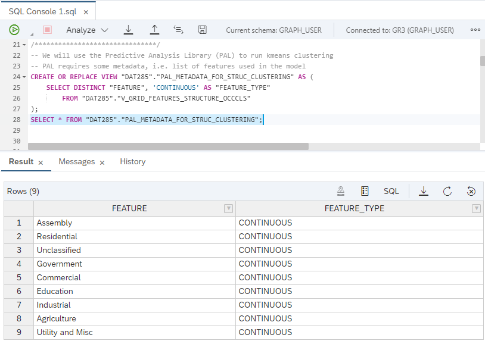
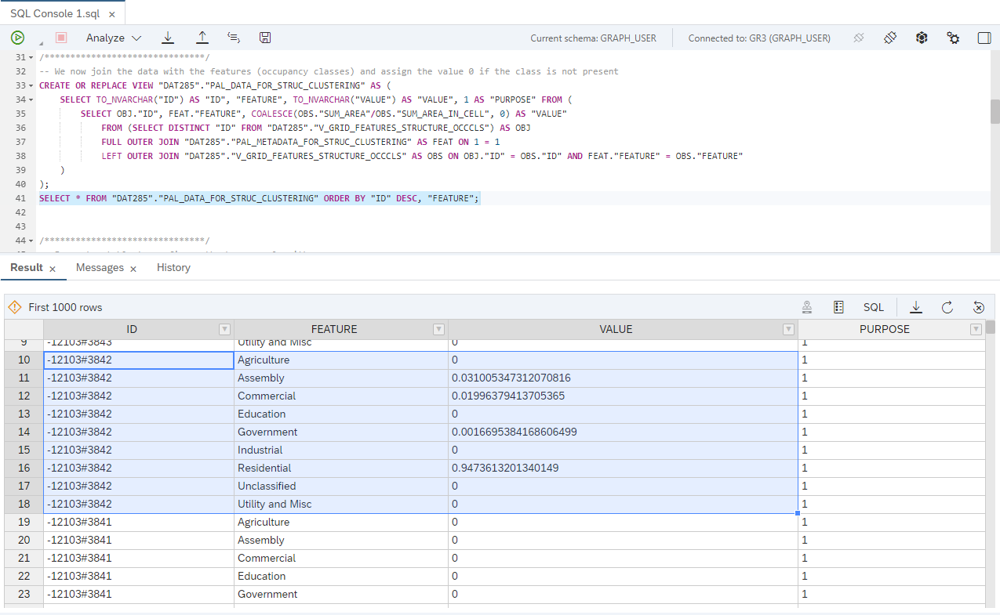
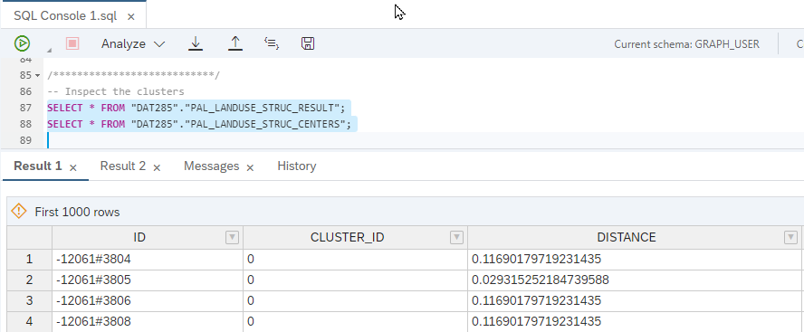
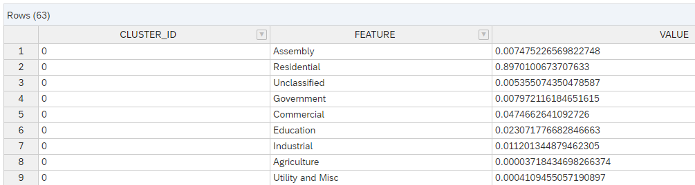
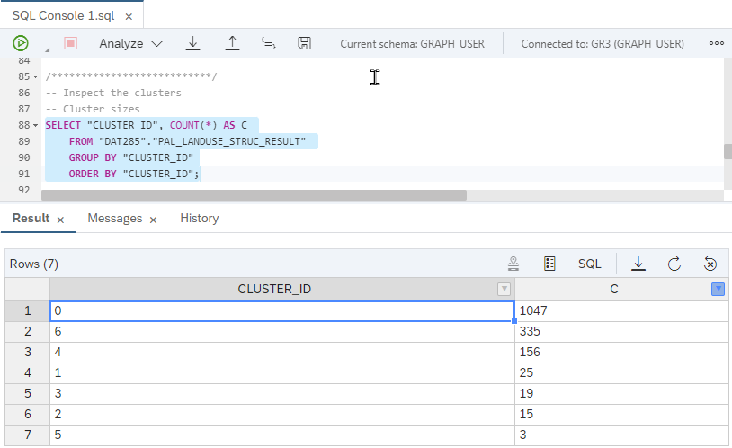
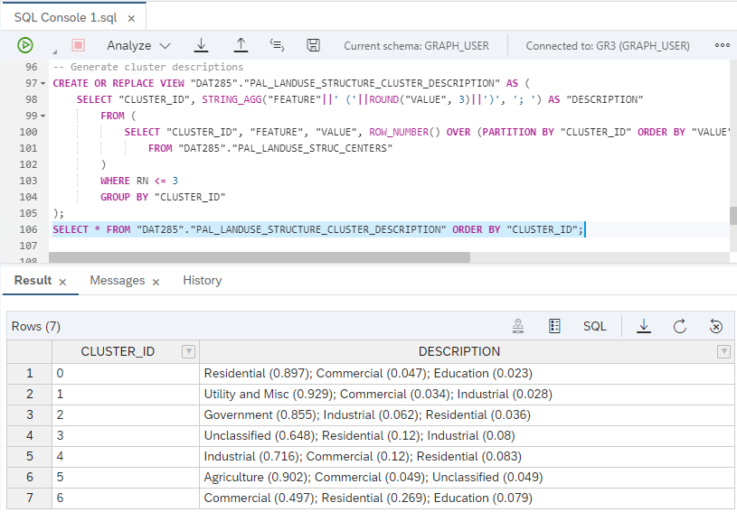
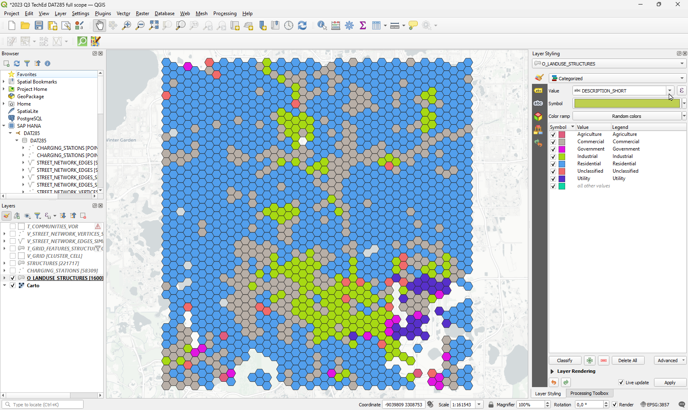
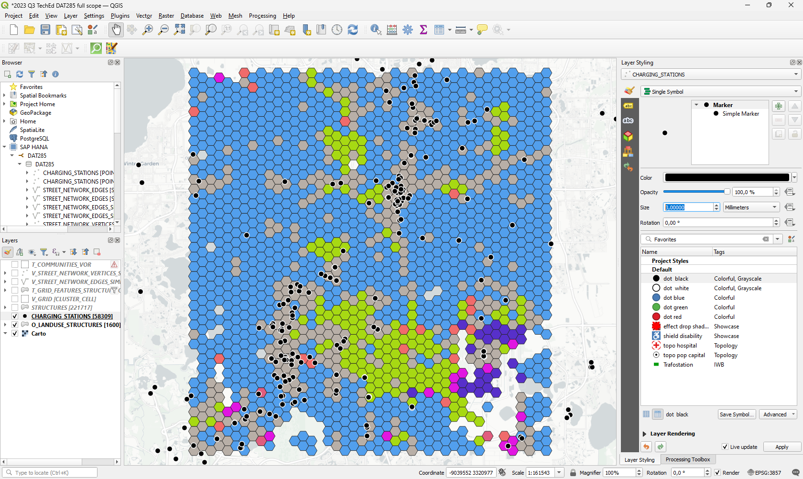

# Exercise 4 - Utilize Machine Learning

This exercise is optional. It requires a SAP HANA Cloud system with the **Script Server** enabled. If you have a SAP HANA Cloud trial or free tier, skip this exercise.

In this exercise, we will use basic ML features to derive landuse classification.

At the end of [Exercise 2.3 Calculate spatial features from building structres](exercises/ex2#23), we calculated the building structures area by occupancy class for each hexagon grid cell.



Now, we use the Predictive Analysis Library (PAL) to run k means clustering on this raw data. The result is a set of clusters, in which areas with similar landuse characteristics (=occupany class distibution) are grouped.


## Exercise 4.1 Prepare data

To run a PAL algorithm, we need to prepare some metadata and configuration parameters. The metadata tells the algoithm which features to use, the configuration provides a handle on partially optional algorithm parameters.

First, we just expose all features in our raw data via a SQL view.
```SQL
-- PAL requires some metadata, i.e. list of features used in the model
CREATE OR REPLACE VIEW "DAT285"."PAL_METADATA_FOR_STRUC_CLUSTERING" AS (
	SELECT DISTINCT "FEATURE", 'CONTINUOUS' AS "FEATURE_TYPE" 
		FROM "DAT285"."V_GRID_FEATURES_STRUCTURE_OCCCLS" 
);
SELECT * FROM "DAT285"."PAL_METADATA_FOR_STRUC_CLUSTERING";
```



Next, we join our raw data to the list of features. The value 0 is assigned if a feature (=occupancy class) is not present in a grid cell.

```SQL
-- We now join the data with the features (occupancy classes) and assign the value 0 if the class is not present
CREATE OR REPLACE VIEW "DAT285"."PAL_DATA_FOR_STRUC_CLUSTERING" AS (
	SELECT TO_NVARCHAR("ID") AS "ID", "FEATURE", TO_NVARCHAR("VALUE") AS "VALUE", 1 AS "PURPOSE" FROM (
		SELECT OBJ."ID", FEAT."FEATURE", COALESCE(OBS."SUM_AREA"/OBS."SUM_AREA_IN_CELL", 0) AS "VALUE" 
			FROM (SELECT DISTINCT "ID" FROM "DAT285"."V_GRID_FEATURES_STRUCTURE_OCCCLS") AS OBJ
			FULL OUTER JOIN "DAT285"."PAL_METADATA_FOR_STRUC_CLUSTERING" AS FEAT ON 1 = 1
			LEFT OUTER JOIN "DAT285"."V_GRID_FEATURES_STRUCTURE_OCCCLS" AS OBS ON OBJ."ID" = OBS."ID" AND FEAT."FEATURE" = OBS."FEATURE"
	)
);
SELECT * FROM "DAT285"."PAL_DATA_FOR_STRUC_CLUSTERING" ORDER BY "ID" DESC, "FEATURE";
```

The grid cell with "ID" = '-12103#3842' doesn't contain agricultural buildings, just assemplies, commercial, governmental, and residential buildings.



Next, we create a table that holds the configuration parameters for our PAL procedure. See [Unified Clustering with Pivoted Input Data](https://help.sap.com/docs/hana-cloud-database/sap-hana-cloud-sap-hana-database-predictive-analysis-library/unified-clustering-with-pivoted-input-data?version=2022_3_QRC) for details.

```SQL
-- Parameter table to configure the k means algorithm
CREATE COLUMN TABLE "DAT285"."PAL_PARAMS_FOR_STRUC_CLUSTERING" (
	"NAME" VARCHAR (50),
	"INT_VALUE" INTEGER,
	"DOUBLE_VALUE" DOUBLE,
	"STRING_VALUE" VARCHAR (100)
); 

-- AKMEANS
INSERT INTO "DAT285"."PAL_PARAMS_FOR_STRUC_CLUSTERING" VALUES ('FUNCTION', NULL, NULL, 'AKMEANS');
INSERT INTO "DAT285"."PAL_PARAMS_FOR_STRUC_CLUSTERING" VALUES ('THREAD_RATIO', NULL, 1.0, NULL); 
INSERT INTO "DAT285"."PAL_PARAMS_FOR_STRUC_CLUSTERING" VALUES ('N_CLUSTERS_MIN', 2, NULL, NULL);
INSERT INTO "DAT285"."PAL_PARAMS_FOR_STRUC_CLUSTERING" VALUES ('N_CLUSTERS_MAX', 9, NULL, NULL);
INSERT INTO "DAT285"."PAL_PARAMS_FOR_STRUC_CLUSTERING" VALUES ('INIT', 4, NULL, NULL);
INSERT INTO "DAT285"."PAL_PARAMS_FOR_STRUC_CLUSTERING" VALUES ('DISTANCE_LEVEL', 2, NULL, NULL); 
INSERT INTO "DAT285"."PAL_PARAMS_FOR_STRUC_CLUSTERING" VALUES ('MAX_ITER', 100, NULL, NULL); 
INSERT INTO "DAT285"."PAL_PARAMS_FOR_STRUC_CLUSTERING" VALUES ('TOL', NULL, 1.0E-6, NULL); 
```

## Exercise 4.2 Run PAL KMEANS

Now, we call the PAL procedure providing metadata, data, and configuraiton, and store the results in two tables: `PAL_LANDUSE_STRUC_RESULT` and `PAL_LANDUSE_STRUC_CENTERS`.

```SQL
DO BEGIN
	meta_data_tab = SELECT * FROM "DAT285"."PAL_METADATA_FOR_STRUC_CLUSTERING";
	data_tab = SELECT * FROM "DAT285"."PAL_DATA_FOR_STRUC_CLUSTERING"; 
	params_tab = SELECT * FROM "DAT285"."PAL_PARAMS_FOR_STRUC_CLUSTERING";

	CALL "_SYS_AFL"."PAL_UNIFIED_CLUSTERING_PIVOT"(:meta_data_tab, :data_tab, :params_tab, res, centers, model, stats, optparams, t1, t2);

	CREATE TABLE "DAT285"."PAL_LANDUSE_STRUC_RESULT" AS (SELECT * FROM :res);
	CREATE TABLE "DAT285"."PAL_LANDUSE_STRUC_CENTERS" AS (SELECT "CLUSTER_ID", TO_NVARCHAR("VARIABLE_NAME") AS "FEATURE", TO_DOUBLE("VALUE") AS "VALUE" FROM :centers);	
END;
```

The first table `PAL_LANDUSE_STRUC_RESULT` contains the cluster assingments for each cell, along tih its distance to the clusters' center; the second table `PAL_LANDUSE_STRUC_CENTERS` contains the centroid of each cluster.




If we inspect the clusters' sizes, ...

```SQL
SELECT "CLUSTER_ID", COUNT(*) AS C 
	FROM "DAT285"."PAL_LANDUSE_STRUC_RESULT" 
	GROUP BY "CLUSTER_ID"
	ORDER BY "CLUSTER_ID";
```

.. we see that we found 7 clusters of which the largest (CLUSTER_ID" = 0) contains 1047 grid cells.



Next, we will generate cluster description based on the centers. We just concatenate the top 3 occupancy classes and their values.

```SQL
-- Generate cluster descriptions
CREATE OR REPLACE VIEW "DAT285"."PAL_LANDUSE_STRUCTURE_CLUSTER_DESCRIPTION" AS (
	SELECT "CLUSTER_ID", STRING_AGG("FEATURE"||' ('||ROUND("VALUE", 3)||')', '; ') AS "DESCRIPTION" 
		FROM (
			SELECT "CLUSTER_ID", "FEATURE", "VALUE", ROW_NUMBER() OVER (PARTITION BY "CLUSTER_ID" ORDER BY "VALUE" DESC) AS RN
				FROM "DAT285"."PAL_LANDUSE_STRUC_CENTERS"
		)
		WHERE RN <= 3
		GROUP BY "CLUSTER_ID"
);
SELECT * FROM "DAT285"."PAL_LANDUSE_STRUCTURE_CLUSTER_DESCRIPTION" ORDER BY "CLUSTER_ID";
```

Cluster 0 can be described as primarily residential plus a some comercial building structures.



Finally, we ceate a SQL viewfor visualization which combines the grid polygons, the cluster assignment, and the descriptions.

```SQL
-- Generate a result view for visualization
CREATE OR REPLACE VIEW "DAT285"."O_LANDUSE_STRUCTURES" AS (
	SELECT G."ID", G."CLUSTER_CELL", C."CLUSTER_ID", C."DISTANCE", C."SLIGHT_SILHOUETTE", T."DESCRIPTION", 
	LEFT(T."DESCRIPTION", LOCATE(T."DESCRIPTION", ' ')) AS "DESCRIPTION_SHORT"
		FROM "DAT285"."V_GRID" AS G 
		INNER JOIN "DAT285"."PAL_LANDUSE_STRUC_RESULT" AS C ON G."ID" = C."ID"
		LEFT JOIN "DAT285"."PAL_LANDUSE_STRUCTURE_CLUSTER_DESCRIPTION" AS T ON C."CLUSTER_ID" = T."CLUSTER_ID"
);
SELECT * FROM "DAT285"."O_LANDUSE_STRUCTURES";
```

We can now bring the data from this view onto a map in QGIS and see primarily commercial areas in grey.



Finally, we can overlay the electriv vehicles charging stations to see that they are mainly located in commercial areas.



## Summary

We have used spatial features derived from building structures in a simple PAL k means algorithm and derived landuse classes.

